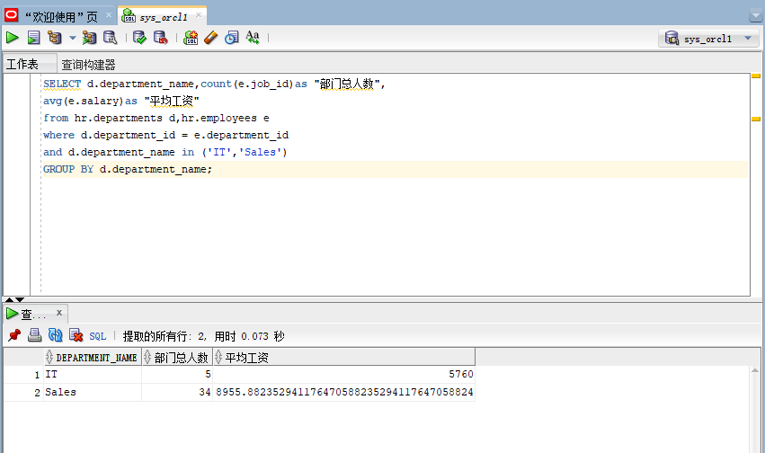
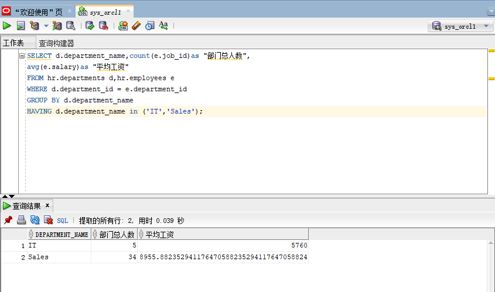
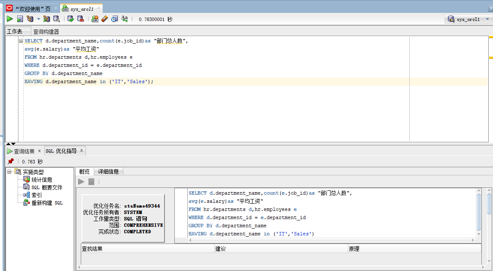
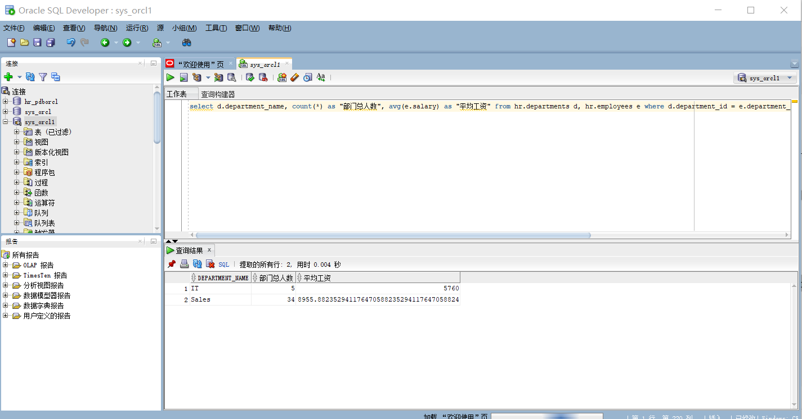

# 姓名：马宇
# 学号：201810414214
# 班级：2018级软工2班

# 实验一：SQL语句的执行计划分析与优化指导
## 实验目的
分析SQL执行计划，执行SQL语句的优化指导。理解分析SQL语句的执行计划的重要作用。
## 实验内容
•对Oracle12c中的HR人力资源管理系统中的表进行查询与分析。
•首先运行和分析教材中的样例：本训练任务目的是查询两个部门('IT'和'Sales')的部门总人数和平均工资，以下两个查询的结果是一样的。但效率不相同。
•设计自己的查询语句，并作相应的分析，查询语句不能太简单。
## 查询语句
### 查询语句一
set autotrace on
SELECT d.department_name,count(e.job_id)as "部门总人数", avg(e.salary)as "平均工资" from hr.departments d,hr.employees e where d.department_id = e.department_id and d.department_name in ('IT','Sales') GROUP BY d.department_name;
### 运行结果

#### 分析
先用where进行条件筛选，选出符合d.department_id = e.department_id，d.department_name in ('IT','Sales')的所有匹配项，再使用group by来分组，最后用count和avg分别计算部门总人数和平均工资。
### 查询语句二
set autotrace on
SELECT d.department_name,count(e.job_id)as "部门总人数", avg(e.salary)as "平均工资" FROM hr.departments d,hr.employees e WHERE d.department_id = e.department_id GROUP BY d.department_name HAVING d.department_name in ('IT','Sales');
### 运行结果

#### 分析
先用where进行条件筛选，选出符合d.department_id = e.department_id的所有匹配项,然后直接用GROUP BY按部门名进行分组，然后再在分组中通过HAVING d.department_name in ('IT','Sales')进行查询，最后用count和avg分别计算部门总人数和平均工资。
### 语句对比
由本次实验结果来分析，使用查询语句一用时0.073s，而使用查询语句二时用了0.039s,显然查询语句二的效率高于查询语句一。查询二先按部门名进行分组，再进行部门判断查询，相对与查询语句一中直接对部门名进行判断，减少了查询量，从而效率上得到提升。
### 工具优化

### 自己的查询语句
set autotrace on
select d.department_name, count(*) as "部门总人数", avg(e.salary) as "平均工资" from hr.departments d, hr.employees e where d.department_id = e.department_id GROUP BY d.department_name HAVING d.department_name in ('IT','Sales');
### 运行结果

#### 分析
可以通过在统计部门人数时直接统计全部的人数以提高查询效率。
