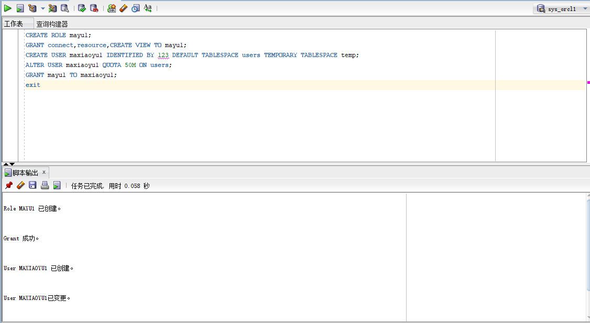
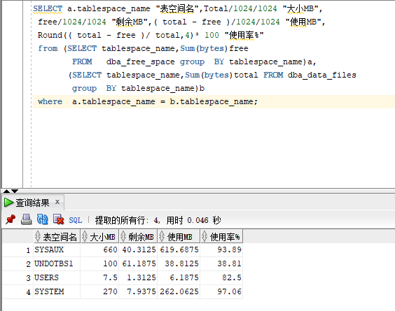

# 姓名：马宇
# 学号：201810414214
# 班级：2018级软工2班

# 实验2：用户及权限管理
## 实验目的

掌握用户管理、角色管理、权根维护与分配的能力，掌握用户之间共享对象的操作技能。

## 实验内容

Oracle有一个开发者角色resource，可以创建表、过程、触发器等对象，但是不能创建视图。本训练要求：

•在pdborcl插接式数据中创建一个新的本地角色mayu1，该角色包含connect和resource角色，同时也包含CREATE VIEW权限，这样任何拥有mayu1的用户就同时拥有这三种权限。

•创建角色之后，再创建用户new_user，给用户分配表空间，设置限额为50M，授予mayu1角色。

•最后测试：用新用户maxiaoyu1连接数据库、创建表，插入数据，创建视图，查询表和视图的数据。

## 实验步骤

•第1步：以system登录到pdborcl，创建角色mayu1和用户maxiaoyu1，并授权和分配空间：

CREATE ROLE mayu1;
GRANT connect,resource,CREATE VIEW TO mayu1;
CREATE USER maxiaoyu1 IDENTIFIED BY 123 DEFAULT TABLESPACE users TEMPORARY TABLESPACE temp;
ALTER USER maxiaoyu1 QUOTA 50M ON users;
GRANT mayu1 TO maxiaoyu1;
exit

•分析：先创建角色mayu1,再让它包含connect角色、resource角色和CREATE VIEW权限。创建用户maxiaoyu1，密码为123，授权maxiaoyu1用户访问users表空间，空间限额是50M,最后让用户maxiaoyu1包含角色mayu1。

•第2步：新用户new_user连接到pdborcl，创建表mytable和视图myview，插入数据，最后将myview的SELECT对象权限授予hr用户。

show user;
 CREATE TABLE mytable (id number,name varchar(50));
 INSERT INTO mytable(id,name)VALUES(1,'ma');
 INSERT INTO mytable(id,name)VALUES (2,'zeng');
 CREATE VIEW myview AS SELECT name FROM mytable;
 SELECT * FROM myview;
 GRANT SELECT ON myview TO hr;
 exit

•第3步：用户hr连接到pdborcl，查询new_user授予它的视图myview

SELECT * FROM new_user.myview;

•表的共享

grant select on MYTABLE to deep_love;

## 数据库和表空间占用分析

从数据库使用情况中可以看出，表空间SYSTEM、SYSAUX使用率较高，其中SYSTEM高，

270MB空间大小使用了262.0625MB，可以看出同学们对它的使用频率很高，而UNDOTBSL则

相对较少。

## 查看数据库的使用情况

•查看表空间的数据库文件，以及每个文件的磁盘占用情况。

其中autoextensible是显示表空间中的数据文件是否自动增加,从图中可以看出USERS表空间的数据文件是自动增加的。MAX_MB是指数据文件的最大容量，可以看出，SYSAUX表空间总容量最大。