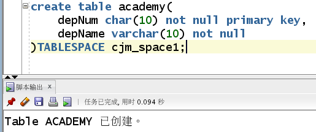

# 姓名: 马宇
# 学号: 201810414214  班级:2018级软工二班

## 实验6: 基于Oracle的某项目数据库设计

## 实验要求

·自行设计一个信息系统的数据库项目，自拟 某项目 名称。

·设计项目涉及的表及表空间使用方案。至少5张表和5万条数据，两个表空间。

·设计权限及用户分配方案。至少两类角色，两个用户。

·在数据库中建立一个程序包，在包中用PL/SQL语言设计一些存储过程和函数，

·实现比较复杂的业务逻辑，用模拟数据进行执行计划分析。

·设计自动备份方案或则手工备份方案。

·设计容灾方案。使用两台主机，通过DataGuard实现数据库整体的异地备份(可选)。

## 实验选题: 学生选课管理系统数据库设计

## 实验内容

### 1. 数据库E-R图设计

    ​学生选课管理系统用于学生选课，主要包含学生、教师、专业信息、院系信息、课程信息、选课信息等实体。

### 2.实体分析。

    本数据库共6格实体。
    学生：学号（主键）、姓名、性别、专业号（外键）、进校时间、出生日期。
    教师：工号（主键）、姓名、性别、学院编号（外键）、出生日期。
    专业：专业编号（主键）、专业名、学院编号（外键）。
    学院：学院编号（主键）、学院编号。
    课程：课程编号（主键）、课程名（外键）、学时、学分。
    课程信息：选课编号（主键）、学生学号（外键）、成绩、教师工号（外键）。
### 3.数据表设计

1）学生表（students）
|  字段名   | 数据类型   |  可以为空   |  注释                |
|  ----     |   ----    |     ----    | ----                |
|studentNum  | char(10) | NO  | studentNum,主键          |
| majorNum| char(10) | NO  | 专业号，外键 |
| studentName| varchar(10) | YES  | 姓名 |
|studentSex| char(2) | YES  | 性别|
| studentBirthday| date | YES  | 出生日期 |
| regtime| date | YES  | 进校时间 |

2）教师表（teachers）
|  字段名   | 数据类型   |  可以为空   |  注释                |
|  ----     |   ----    |     ----    | ----                |
| teacherNum  | char(10) | NO  | 工号,主键          |
|  deptNum| 学院编号 | NO  |学院编号，外键|
| teacherName | varchar(10)  | NO  | 姓名         |
| teacherSex| char(2) | YES  | 性别 |
| teacherBirthday | date | YES  | 出生日期    |

3）专业信息表（major）
|  字段名   | 数据类型   |  可以为空   |  注释       |
|  ----     |   ----    |     ----    | ----       |
| majorNum  | char(10) | NO  | 专业编号,主键    |
| depNum| char(10)| NO  | 学院编号，外键 |
| majorName| varchar(20) | NO  | 专业名 |

4）院系信息表（academy）
|  字段名   | 数据类型   |  可以为空   |  注释       |
|  ----     |   ----    |     ----    | ----       |
| depNum  |char(10) | NO  | 学院编码,主键|
| depName| Varchar（20）| NO  | 院系名称 |

5）课程表（course）
ORDERS_DETAILS(订单详单)
|  字段名   | 数据类型   |  可以为空   |  注释       |
|  ----     |   ----    |     ----    | ----       |
| courseNum | char(10) | NO  | 课程编号,主键|
| courseName| varchar（20） | NO  | 课程名，外键 |
| courseCredit| char（2） | NO  | 学分|
| courseTime  | char（3） | NO  | 学时|

6）选课信息表（choseCourse）
ORDERS_ID_TEMP(订单ID临时表)
|  字段名   | 数据类型   |  可以为空   |  注释       |
|  ----     |   ----    |     ----    | ----       |
|stuCourse  | Int | NO  | 选课编号，主键|
|studentNum  | char（20） | NO  | 学生学号，外键|
|teacherNum | char（10） | NO  | 教师工号，外键|
|grade  | char（3） | NO  | 成绩|

### 4.数据库创建。
#### 4.1.数据库创建

    create p1uggable database cjmpdb admin user cjm identified by 123 file_name_convert=('/home/oracle/app/oracle/oradata/orcl/pdbseed/',' /home/oracle/ app/oracle/oradata/orcl/cjmpdb');
    创建数据库cjmpdb,创建管理员用户cjm

#### 4.2.用户授权。

    alter pluggable database cjmpdb open;
	grant dba to cjm;
    对创建的cjm用户进行授权。

#### 4.3.创建表空间。

    create tablespace 
    cjm_space1
    datafile '/home/oracle/app/oracle/oradata/orcl/cjmpdb/cjm_space1.dbf' 
    size 150M 
    autoextend on next 50m
    maxsize unlimited;

    create tablespace cjm_space2 DATAFILE
    '/home/oracle/app/oracle/oradata/orcl/cjmpdb/cjm_space2.bdf' SIZE 5	0M AUTOEXTEND ON NEXT 5M MAXSIZE 100M;

    create tablespace cjm_space3 DATAFILE
    '/home/oracle/app/oracle/oradata/orcl/cjmpdb/cjm_space3.bdf' SIZE 5	0M AUTOEXTEND ON NEXT 5M MAXSIZE 100M;
    创建三个表空间分别为cjm_space1,cjm_space2,cjm_space3

#### 4.4.创建表并对学生表分区。
##### （1）学生表
    create table students(
        studentNum char(10) not null primary key,
        majorNum char(10) not null,
        studentName varchar(10),
        studentSex char(2),
        studentBirthday date,
        regtime date not null
    )partition by range (regtime)(
    partition p1 values LESS THAN (TO_DATE(' 2018-01-01 00:00:00', 'SYYYY-MM-DD HH24:MI:SS', 'NLS_CALENDAR=GREGORIAN')) tablespace cjm_space1,

        partition p2 values LESS THAN (TO_DATE(' 2019-01-01 00:00:00', 'SYYYY-MM-DD HH24:MI:SS', 'NLS_CALENDAR=GREGORIAN')) tablespace cjm_space2,
    partition p3 values LESS THAN (MAXVALUE) tablespace cjm_space3)

这里对进校时间进行分区,将2018年之前、2018-2019、2019年之后的数据分别放入三个分区之中。

##### （2）教师表
    create table teachers(
    teacherNum char(10) not null primary key,
    depNum char(10) not null,
    teacherName varchar(10),
    teacherSex char(2),
    teacherBirthday date
)TABLESPACE cjm_space1;

    
##### （3）专业信息表
    create table major(
        majorNum char(10) not null primary key,
        depNum char(10) not null,
        majorName varchar(20)
        )TABLESPACE cjm_space1;

##### （4）学院信息表
    create table academy(
    depNum char(10) not null primary key,
    depName varchar(10) not null
    )TABLESPACE cjm_space1;

##### （5）课程信息表
    create table course(
    courseNum char(10) not null primary key,
    courseName varchar(20) not null,
    courseCredit char(2),
    courseTime char(3)
    )TABLESPACE cjm_space1

##### （6）选课信息表。
    create table choseCourse(
    stuCourse int not null primary key,
    studentNum char(20) not null,
    teacherNum char(10) not null,
    grade char(3)
    )TABLESPACE cjm_space1

#### 4.5.创建新用户授权并插入数据。
##### （1）分别创建两个用户cjm_user1和cjm_user2,，授予他们使用表空间cjm_space1的权限。
    create user cjm_user1 IDENTIFIED by 123;
    create user cjm_user2 IDENTIFIED by 123;
    alter user cjm_user1 quota unlimited on cjm_space1;
    alter user cjm_user2 quota unlimited on cjm_space1;

##### （2）创建两个角色cjm_role1，cjm_role2，并分别赋予cjm_role1，cjm_role2读任何表和读、修改任何表的权利；
    create role cjm_role1;
    create role  cjm_role2;
    grant select any table to cjm_role1;
    grant select any table to cjm_role2;
    grant update any table to cjm_role2;

##### （3）将cjm_role1，cjm_role2分别赋予给用户cjm_user1，cjm_user2。
    grant cjm_role1 to cjm_user1;
    grant cjm_role2 to cjm_user2;

##### （4）插入数据。
教师表
    insert into teachers(teacherNum,depNum,teacherName,teacherSex,teacherBirthday) values('1','1','张三','男',to_date('19900414','yyyymmdd'));
    insert into teachers(teacherNum,depNum,teacherName,teacherSex,teacherBirthday) values('2','1','李四','1',to_date('19880717','yyyymmdd'));
    insert into teachers(teacherNum,depNum,teacherName,teacherSex,teacherBirthday) values('3','1','王五','1',to_date('19951010','yyyymmdd'));
    insert into teachers(teacherNum,depNum,teacherName,teacherSex,teacherBirthday) values('4','2','李美丽','0',to_date('19850917','yyyymmdd'));
    insert into teachers(teacherNum,depNum,teacherName,teacherSex,teacherBirthday) values('5','2','王万华','0',to_date('19830717','yyyymmdd'));
    insert into teachers(teacherNum,depNum,teacherName,teacherSex,teacherBirthday) values('6','3','陈春芳','0',to_date('19880717','yyyymmdd'));
    insert into teachers(teacherNum,depNum,teacherName,teacherSex,teacherBirthday) values('7','3','吴新','1',to_date('19880317','yyyymmdd'));
    insert into teachers(teacherNum,depNum,teacherName,teacherSex,teacherBirthday) values('8','1','张以','男',to_date('15500414','yyyymmdd'));
    insert into teachers(teacherNum,depNum,teacherName,teacherSex,teacherBirthday) values('9','1','李次四','1',to_date('19880717','yyyymmdd'));
    insert into teachers(teacherNum,depNum,teacherName,teacherSex,teacherBirthday) values('10','1','王五','1',to_date('19951010','yyyymmdd'));
    insert into teachers(teacherNum,depNum,teacherName,teacherSex,teacherBirthday) values('11','2','李美丽','0',to_date('19850917','yyyymmdd'));
    insert into teachers(teacherNum,depNum,teacherName,teacherSex,teacherBirthday) values('12','2','王万华','0',to_date('19830717','yyyymmdd'));
    insert into teachers(teacherNum,depNum,teacherName,teacherSex,teacherBirthday) values('13','3','陈春芳','0',to_date('19880717','yyyymmdd'));
    insert into teachers(teacherNum,depNum,teacherName,teacherSex,teacherBirthday) values('14','3','吴新','1',to_date('19880317','yyyymmdd'));

    insert into teachers(teacherNum,depNum,teacherName,teacherSex,teacherBirthday)values('15','1','张三','男',to_date('19900414','yyyymmdd'));
    insert into teachers(teacherNum,depNum,teacherName,teacherSex,teacherBirthday) values('16','1','李四','1',to_date('19880717','yyyymmdd'));
    insert into teachers(teacherNum,depNum,teacherName,teacherSex,teacherBirthday) values('17','1','王五','1',to_date('19951010','yyyymmdd'));
    insert into teachers(teacherNum,depNum,teacherName,teacherSex,teacherBirthday) values('18','2','李美丽','0',to_date('19850917','yyyymmdd'));
    insert into teachers(teacherNum,depNum,teacherName,teacherSex,teacherBirthday) values('19','2','王万华','0',to_date('19830717','yyyymmdd'));
    insert into teachers(teacherNum,depNum,teacherName,teacherSex,teacherBirthday) values('20','3','陈春芳','0',to_date('19880717','yyyymmdd'));
    insert into teachers(teacherNum,depNum,teacherName,teacherSex,teacherBirthday) values('21','3','吴新','1',to_date('19880317','yyyymmdd'));

    insert into teachers(teacherNum,depNum,teacherName,teacherSex,teacherBirthday) values('22','1','张三','男',to_date('19900414','yyyymmdd'));
    insert into teachers(teacherNum,depNum,teacherName,teacherSex,teacherBirthday) values('23','1','李四','1',to_date('19880717','yyyymmdd'));
    insert into teachers(teacherNum,depNum,teacherName,teacherSex,teacherBirthday) values('24','1','王五','1',to_date('19951010','yyyymmdd'));
    insert into teachers(teacherNum,depNum,teacherName,teacherSex,teacherBirthday) values('25','2','李美丽','0',to_date('19850917','yyyymmdd'));
    insert into teachers(teacherNum,depNum,teacherName,teacherSex,teacherBirthday) values('26','2','王万华','0',to_date('19830717','yyyymmdd'));
    insert into teachers(teacherNum,depNum,teacherName,teacherSex,teacherBirthday) values('27','3','陈春芳','0',to_date('19880717','yyyymmdd'));
    insert into teachers(teacherNum,depNum,teacherName,teacherSex,teacherBirthday) values('28','3','吴新','1',to_date('19880317','yyyymmdd'));

专业表

    insert into major(majorNum,depNum,majorName) values('1','1','数媒');
    insert into major(majorNum,depNum,majorName) values('2','1','毛概');
    insert into major(majorNum,depNum,majorName) values('3','2','计科');
    insert into major(majorNum,depNum,majorName) values('4','2','软件工程');
    insert into major(majorNum,depNum,majorName) values('5','3','电信');
    insert into major(majorNum,depNum,majorName) values('6','3','网工');     

学院信息表

    insert into academy(depNum,depName)values('1','新媒体');
    insert into academy(depNum,depName)values('2','计算机');
    insert into academy(depNum,depName)values('3','体育');
    insert into academy(depNum,depName)values('4','师范');
    insert into academy(depNum,depName)values('5','医护');
    insert into academy(depNum,depName)values('6','马克思');

课程信息表

    Insert into course(courseNum,courseName,courseCredit,courseTime)values('1','文化传播','3','64');
    insert into course(courseNum,courseName,courseCredit,courseTime)values('2','传播学导论','2','24');
    insert into course(courseNum,courseName,courseCredit,courseTime)values('3','民族文化','3','32');
    insert into course(courseNum,courseName,courseCredit,courseTime)values('4','c语言基础','3','64');
    insert into course(courseNum,courseName,courseCredit,courseTime)values('5','线代','3','64');
    insert into course(courseNum,courseName,courseCredit,courseTime)values('6','数据结构','2','64');
    insert into course(courseNum,courseName,courseCredit,courseTime)values('7','篮球教练','2','64');
    insert into course(courseNum,courseName,courseCredit,courseTime)values('8','人体健康','4','64');
    insert into course(courseNum,courseName,courseCredit,courseTime)values('9','游泳基础','6','64');

    declare
        studentNum char(10);
        majorNum char(10);
        studentName varchar(10);
        studentSex char(2);
        studentBirthday date;
        regtime date;
    begin
        for i in 1..50000
        loop
        if i mod 3=0 then
        regtime:=to_date('2018-01-01','yyyy-mm-dd')+(i mod 60);
        elsif i mod 6=1 then
        regtime:=to_date('2019-01-01','yyyy-mm-dd')+(i mod 60);
        end if;
        
        studentNum:=i;
        majorNum:=case i mod 6 when 0 then '1'when 1 then '2'when 2 then '3'when 4 then'4'else'5'end;
        studentName:=case i mod 6 when 0 then'站三'when 1 then'万方'when 2 then '吴金'when 3 then'微佳'when 4 then '陈达到'else '王积极'end;
        studentSex:=case i mod 2 when 0 then '0'else '1'end;
        studentBirthday:=to_date('19980512','yyyymmdd');
        
        insert into students(studentNum,majorNum,studentName,studentSex,studentBirthday,regtime)values(studentNum,majorNum,studentName,studentSex,studentBirthday,regtime);
        
        end loop;
    end;

#### 4.6.分区授权验证。
##### （1）让cjm_user1连接数据库cjmpdb,让其查看cjm的students表，可以看见的，而无法进行更新操作。

##### （2）根据students表中的regtime字段根据时间段的不同，将其放在了不同的表空间里面，由下图可知，每个表空间里面均有students的数据，说明分区成功。

#### 4.7.建立程序包。
建立一个程序包，里面有一个函数和一个存储过程，其功能分别为：统计一段时间内注册入学学生中男生人数；统计一段时间内，各个专业人数。

    create or replace PACKAGE MyPack IS
    FUNCTION GET_MAN(dt1 char,dt2 char) RETURN NUMBER;
    PROCEDURE get_majornum(dt1 char,dt2 char);
    END MyPack;
    /
    create or replace PACKAGE BODY MyPack IS
    FUNCTION Get_MAN(dt1 char,dt2 char) RETURN NUMBER
    AS
        N  NUMBER;
        BEGIN
        select sum(studentSex) into N from students where regtime >= to_date(dt1,'yyyy-mm-dd hh24:mi:ss')
        and regtime <= to_date(dt2,'yyyy-mm-dd hh24:mi:ss');
        RETURN N;
        END;

    -- 
    PROCEDURE get_majornum(dt1 char,dt2 char)
    AS
        a1 NUMBER;
        b1 NUMBER;
        c1 NUMBER;
        d1 NUMBER;
        e1 NUMBER;
        f1 NUMBER;
        cursor cur is
        select * from students where regtime>= to_date(dt1,'yyyy-mm-dd hh24:mi:ss')
        and regtime <= to_date(dt2,'yyyy-mm-dd hh24:mi:ss');
        begin
        a1 := 0;
        b1 := 0;
        c1 := 0;
        d1 := 0;
        e1 := 0;
        f1 := 0;
        
        for v in cur 
        LOOP
            if v.majornum = '1'
                then a1 := a1 + 1;
            elsif v.majornum = '2'
                then b1 := b1 + 1;
            elsif v.majornum  = '3'
                then c1 := c1 + 1;
            elsif v.majornum  = '4'
                then d1 := d1 + 1;
            elsif v.majornum  = '5'
                then e1 := e1 + 1;
            end if;
        END LOOP;
        DBMS_OUTPUT.PUT_LINE('新媒体学院人数为：' ||  a1);
        DBMS_OUTPUT.PUT_LINE('体育学院人数为：' ||  b1);
        DBMS_OUTPUT.PUT_LINE('信工学院人数为：' ||  c1);
        DBMS_OUTPUT.PUT_LINE('政治学院为：' ||  d1);
        DBMS_OUTPUT.PUT_LINE('医学院为：' ||  e1);
    
        end;
    END MyPack;

##### 1）函数效果展示

##### 2）存储过程效果展示

#### 4.8.系统备份。
##### （1）rman增量备份脚本
    #rman_level1.sh 
    #!/bin/sh

    export NLS_LANG='SIMPLIFIED CHINESE_CHINA.AL32UTF8'
    export ORACLE_HOME=/home/oracle/app/oracle/product/12.1.0/dbhome_1  
    export ORACLE_SID=orcl  
    export PATH=$ORACLE_HOME/bin:$PATH  

    rman target / nocatalog msglog=/home/oracle/rman_backup/lv1_`date +%Y%m%d-%H%M%S`_L0.log << EOF
    run{
    configure retention policy to redundancy 1;
    configure controlfile autobackup on;
    configure controlfile autobackup format for device type disk to '/home/oracle/rman_backup/%F';
    configure default device type to disk;
    crosscheck backup;
    crosscheck archivelog all;
    allocate channel c1 device type disk;
    backup as compressed backupset incremental level 1 database format '/home/oracle/rman_backup/dblv1_%d_%T_%U.bak'
    plus archivelog format '/home/oracle/rman_backup/arclv1_%d_%T_%U.bak';
    report obsolete;
    delete noprompt obsolete;
    delete noprompt expired backup;
    delete noprompt expired archivelog all;
    release channel c1;
    }
    EOF
    Exit

##### （2）每天的凌晨1点自动进行备份。

## 实验总结

 通过本次实验，我对oracle数据库的相关知识点有了进一步的熟悉和掌握。在本次实验的操作过程中，我回顾了用户的创建与授权及表空间的创建与划分，对其有了更加深刻的理解。同时，能更加熟练地使用一些PL/SQL语言进行一些简单的存储过程和函数的代码编写。除此之外，我还学会了如何设置系统自动备份，在操作过程中对各种SQL语句的使用也越发娴熟。不足的是没能实现容灾方案，不过，总体来说，收获颇丰。
